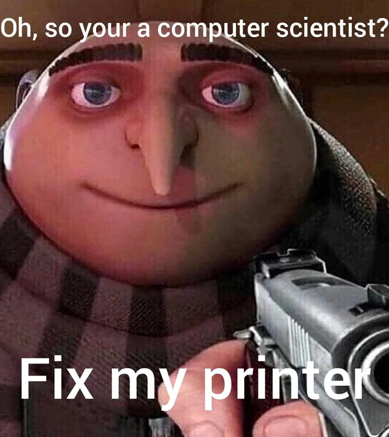

# 👋 Hi, I'm Eliott Colson

💻 Software engineer & AI enthusiast  
☁️ Cloud apprentice @ SNCF Réseau  
🎓 CS Engineering student @ Télécom SudParis (graduating 2027)  

---

## 🚀 About me
- 🔭 Currently working on **cloud engineering & AI pipelines** (Azure, FinOps, RAG)  
- 🎓 Background in **computer science, networks, and software development**  
- ⚡ Certified **Microsoft Azure Fundamentals (AZ-900)**  
- 🏓 Table tennis player & football enthusiast  
- 🕹️ Always curious about **game development**  

---

## 🛠️ Tech Stack
- **Languages:** Python, Java, C++, Dart, JavaScript  
- **Frameworks:** Django, FastAPI, Flutter  
- **Web:** HTML, CSS, Bootstrap, Materialize  
- **Cloud:** Azure, AWS, FinOps basics  
- **DevOps & Tools:** Docker, Docker Compose, Jenkins, Git, GitHub, GitLab  
- **Databases:** SQLite, MySQL, PostgreSQL  

---

## 📌 Featured Projects
- **[CRO]** – Cisco Router Orchestration (Django, Docker, Python)  
  → Web app to manage Cisco router sub-interfaces via SSH  

- **TruckTrack** – Fleet management web app (PHP, SQL, Bootstrap)  
  → Full-stack CRUD system to monitor shipments  

- **Kundt’s Tube Automation** – Arduino + desktop + web app  
  → Automated a physics experiment with motor control & result visualization  

---

## 📫 Connect with me
- 💼 [LinkedIn](https://www.linkedin.com/in/eliottcolson/)  

---

⭐️ _"Code, break, fix, repeat – that’s how I learn!"_
